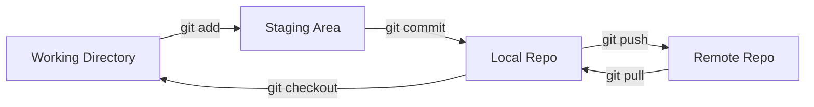

# 1. What is GIT

## Version control system

- Track Project history
- Work together

### Centralized

all team member connect to central server
![[imgs/Pasted image 20250217235049.png]]


share change with other

→ single point of failure (sever offline → fail)

### Distributed

all team member can save snapshots locally on machine

![[imgs/Pasted image 20250219113324.png]]

if server offline it still can work together
→ git and Mercurial is Distributed

---

# 2. Git installing

[https://git-scm.com/](https://git-scm.com/)

---

# 3. Configuring Git

**System :** All users

**Global :** All repositories of the current user

**Local :** The current repository

```js
git config --global user.name "your name"
git config --global user.email "your email"
git config --global core.editor "code --wait" //maybe occur issue -> about path envi (ไม่ต้องทำก็ได้)
git config --global -e
```

- Fix vs code isn’t installed path
    ![[imgs/Pasted image 20250217235211.png]]

## End of line setting

Windows : \r \n

macOS : \n

if don’t handle end of lines properly → run into some weird issues

![[imgs/Pasted image 20250217235243.png]]

```js
git config --global core.autocrlf input //macOS
git config --global core.autocrlf true //windows
```

---

# 4. Initializing a Repository

```js
cd "directory path"
git init //create .git file in directory

```

---

# 5. Git Workflow




## Working directory

→ file directory

## Staging area

proposing for the next commit

allow us to review our work before recording a snapshot

if some changes shouldn’t be recorded as part of the next snapshot

we can unstage them and commit them as another snapshot

---

# 6. Staging Files

## put file into staging area

```js
git add <filename>
git add *.txt // all .txt file
git add . // all file

git ls-files //show tracked files
```

## put file into localrepo

```js
git commit -m "commit message" //commit to localrepo
git commit //edit commit message in editor

```

### Committing Best Practices

- Update file3
- Update file2
- Update file1

→ if you reach a state you want to record THEN make a commit

## Remove File

→ have file in git repo

→ remove "file" in working directory

→ git add "file" //file’s removed

→ git commit -m “remove file”

file is removed

![[imgs/Pasted image 20250218000232.png]]

Git deleted status

## Renaming or Moving Files

```js
mv file1.txt main.py //move file1.txt to main.js (also use at change name)
git add file1.txt //update remove file1.txt
git add main.py //update add main.py

git mv file1.txt main.py //mv file and skip add cmd
```

## Ignore file

all file in .gitignore → ignore file

don’t forget to add/commit .gitignore ( don’t have .gitignore in git init )

```js
echo "" > .gitignore //put "" in gitignore
git commit -am "add .gitignore" //add and commit .gitignore
```

```js
echo logs/ > .gitignore // put logs dic into .gitignore -> ingore logs dict
echo *.log > .gitignore // put *.log into .gitignore -> ingore all .log file
```

study case:

file is already in localrepo → file added to .gitignore later

when edit ignore file, git is still tracking ignore file in staging area has change → remove file in staging area first

```tsx
git rm --cached -r bin/ //remove file in staging area only (--chached)
```

## Short Status

A : file in staging area (new file , already add)

?? : file isn’t tracked

M : file has modifier

M : file has modifier and file in Staging Area (already add)

MM : file in staging area and have modifier doesn’t add into staging area

D : delete file

## Git difftool

```tsx
//setup git difftool

git config --global diff.tool [texteditor]
git config --global diff.tool vscode //set vscode as difftool
git config --global difftool.vscode.cmd "code --wait --diff $LOCAL $REMOTE" 
// --wait is wait editor close
// --diff is use editor for compare

git config --global -e //open .gitconfig
```

![[imgs/Pasted image 20250218000353.png]]
add $LOCAL $REMOTE in cmd

### using git difftool

```tsx
git difftool
git difftool --staged
```

## Viewing history

```tsx
git log //show all log info
git log --oneline //short version of log
git log --oneline --reverse //reverse seq
```

## Viewing a Commit

```js
git show [id from log]
git show HEAD~1 //from top and one step back

git show HEAD~1:.gitignore //view file .gitignore in selected commit
git show HEAD~1:{filename} //view file in commit

git ls-tree [id from log] //view all file in selected commit
git ls-tree HEAD~1

//or using difftool

git difftool [id from log]
git difftool HEAD~1:
```

## Unstaging Files

```tsx
//undo staged change
git restore --staged file1.txt file2.txt
git restore --staged *.txt //all .txt 
git restore --staged *

//undo local change
git restore [file]
```

---

# 7. Restoring a File to an Earlier Version

```tsx
git restore --source=HEAD~1 filename
git restore --source=[commit id] filename
```

---

# 8. Git branch

```tsx
git branch [branch name] //create branch
git switch [branch name] //switch branch
git merge [branch name] //merge branch
git branch -d [branch name] //delete branch
git branch -D [branch name] //delete unmerge branch
git push origin -d [branch name] //delete branch in remote repositor
```

---

# 9. Connect to remote repository (Github)

```tsx
git remote add origin [git https] //add git link (use "origin" as shortcut)

git fetch origin [branch]//ดึงข้อมูลล่าสุดจาก git remote
git pull origin [branch]// fetch + merge (ดึงข้อมูลจาก git ปัจจุบันและ merge เข้า branch ปจบ)
git pull origin [branch] --rebase
```

git fetch → ดูการเปลี่ยนแปลงก่อน merge ได้ (careful)

git pull → merge เลย
git pull + rebase ->

**git pull origin main --rebase**

• ดึงการเปลี่ยนแปลงจาก origin/main

• **Rebase** หมายถึงการนำ commit ใหม่จาก origin/main มาวางก่อน แล้วนำ commit ของคุณไปวางต่อท้าย

• ปรับโครงสร้าง commit ใหม่ ให้ดูเรียบร้อยกว่าแบบ merge

```
ก่อน `git pull --rebase`
origin/main: A -- B -- C
local/main:  A -- B -- X -- Y

หลัง `git pull --rebase`
origin/main: A -- B -- C
local/main:  A -- B -- C -- X' -- Y'  (X, Y ถูกวางใหม่)
```

